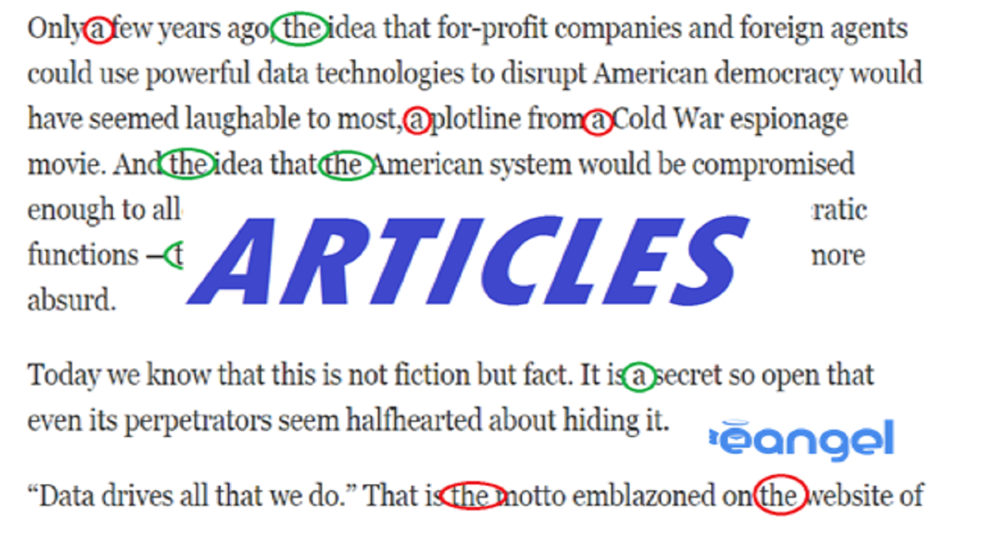
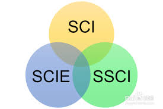

<!DOCTYPE html PUBLIC "-//W3C//DTD XHTML 1.0 Strict//EN" "http://www.w3.org/TR/xhtml1/DTD/xhtml1-strict.dtd">

<html xmlns="http://www.w3.org/1999/xhtml">
<head>

<meta http-equiv="Content-Type" content="text/html; charset=utf-8" />
<title>Admin</title>
<meta name="keywords" content="" />
<meta name="description" content="" />
<meta name="viewport" content="width=device-width, initial-scale=1">
<link href="http://fonts.googleapis.com/css?family=Source+Sans+Pro:200,300,400,600,700,900" rel="stylesheet" />
<link href="main.css" rel="stylesheet" type="text/css" media="all" />
<link href="fonts.css" rel="stylesheet" type="text/css" media="all" />

</head>
<body>

		

	<h1>Welcome to Manipal University Jaipur</a></h1>

	

		<ul>
			<li class="current_page_item"><a href="#"  title="">Research Units</a></li>
			<li><a href="#"  title="">Researchers</a></li>
			<li><a href="#"  title="">Collaborations</a></li>
			<li><a href="#"  title="">Total Publication</a></li>
			<li><a href="#"  title="">Journals</a></li>
			

			  <li><a href="#"  title="">More</a></li>
			  

			    <a href="#">Conferences</a>
			    <a href="#">Books</a>
			    <a href="#">Book Chaptes</a>
			 

			

		</ul>
	

	

		

			<h2>Manipal University Jaipur</h2>
			
		

		
<h4>The Manipal Education Group, with its heritage of excellence in higher education for over 60 years, launched Manipal University Jaipur (MUJ) in 2011. MUJ was established on an invitation from the Government of Rajasthan, as a self-financed State University and is redefining academic excellence in the region. The Vision of the University is to be a “Global Leader in Higher Education and Human Development”. MUJ provides excellent ambience to enhance the teaching-learning experience and to promote creativity and innovation. 

		The University boasts of the best-in-class infrastructure, including the state-of-the-art research facilities and a modern digital library. MUJ, as multi-disciplinary University, offers career- oriented courses at all levels, i.e., UG, PG and Doctoral, across diverse streams, including Engineering, Architecture, Planning, Fashion & Jewellery Design, Fine Arts, Hospitality, Humanities, Journalism and Mass Communication, Basic Sciences, Law, Commerce, Computer Applications, and Management. Currently more than 5000 students from diverse backgrounds have already been enrolled across all programs. A well-qualified team of 405 faculty members is the asset of the University with a large number of them having Ph D. The university plans to recruit additional faculty to take care of the growing number of student admissions. The university has Faculty Development Programme in place through which faculty members tone up their teaching skills and impart best knowledge to the students.
		</h4>
		

	

	

	

		

			<h2>Other Resources</h2>
			We care for our users
		

		

		  

		    

		    	

		      
				
					<a href="appointment.php"><h2>Departments</h2></a>
				

		    

		  

		  

		    

		      
				

					<a href="diagnostic.php"><h2>Faculty Profile</h2></a>
				

		    

		  

		  
		  

		    

		      
				

					<a href="profile.php"><h2>Articles</h2></a>
				

		    

		  

		  
		  

		    

		      
				

					<a href="#"><h2>E-Resouces</h2></a>
				

		    

		  

		

	

	

		

			<h2>PUBLICATIONS</h2>
			
		

		

			
			

				<h2>SCOPUS Publication</h2>
				
Our brain and nervous system are truly miraculous. They control how our bodies work and make us uniquely human – allowing us to create, remember, laugh and dream. When something goes wrong with your nervous system, you may have trouble moving, speaking or learning. And that can be scary.

				
			

		
			
		

			
			

				<h2>Web of Science Publication</h2>
				
Eye Care offers the full spectrum of eye care to clients of all ages, from children to older adults: vision and eye health evaluations, immediate attention for eye emergencies, low vision rehabilitation, pediatric and vision therapy services, orthokeratology/corneal refractive therapy and specialty contact lens fittings.
		
			

		
			
		

			
			

				<h2>SCI/SCIE Publication</h2>
				
Orthopaedic surgeons are devoted to the prevention, diagnosis, and treatment of disorders of the bones, joints, ligaments, tendons and muscles. Some orthopaedists are generalists, while others specialize in certain areas of the body, such as: Hip and knee.

			

		
				
	

		

			<h2>Get in touch</h2>
			connect with us on
		

		<ul class="contact">
			<li><a href="#" class="icon icon-twitter">Twitter</a></li>
			<li><a href="#" class="icon icon-facebook"></a></li>
			<li><a href="#" class="icon icon-dribbble">Pinterest</a></li>
			<li><a href="#" class="icon icon-tumblr">Google+</a></li>
			<li><a href="#" class="icon icon-rss">Pinterest</a></li>
		</ul>

</body>
</html>
